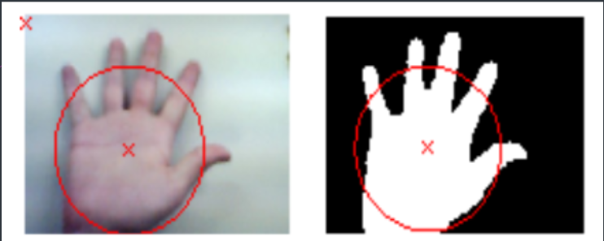
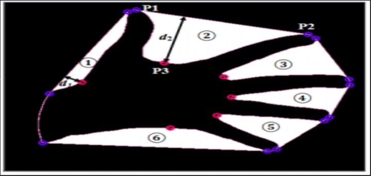

# Gesture Recognition
*Undergraduate Computer Vision Project*  

In this project, I implemented a simple gesture recognition system that can work in
real-time and is computationally inexpensive. It is intended that the
algorithm would be able to identify a predefined set of
gestures with some constraints on the environment. My work is an implementation of this
[research paper](https://ieeexplore.ieee.org/document/1659822).

#### Approach:
1. Define an area for the hand and calculate the average background.
2. Find the contour segmentation and locate the hand contour. 
3. Use Convex Hull to draw a bounding shape for the hand. 
4. Calculate the Center of the hand. 
6. Draw a circle mask from the center of the hand, and identify the number of fingers raised 
based on the intersections.

7. Identify the finger names using the Convex Defect
points by calculating the angle between the hand-axis and the fingertips points.

